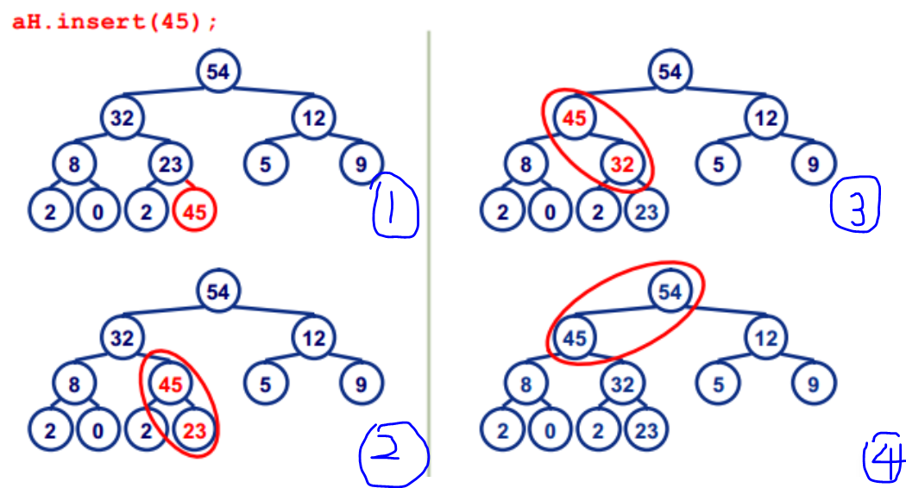

# Hot100

## 归并排序

分为自顶向下和自顶向上的归并排序：https://www.cnblogs.com/nullzx/p/5968170.html

自顶向下的排序算法就是把数组元素不断的二分，直到子数组的元素个数为一个，因为这个时候子数组必定是已有序的，然后将两个有序的序列合并成一个新的有序的序列，两个新的有序序列又可以合并成另一个新的有序序列，以此类推，直到合并成一个有序的数组。

自底向上的归并排序算法的思想就是数组中先一个一个归并成两两有序的序列，两两有序的序列归并成四个四个有序的序列，然后四个四个有序的序列归并八个八个有序的序列，以此类推，直到，归并的长度大于整个数组的长度，此时整个数组有序。需要注意的是数组按照归并长度划分，最后一个子数组可能不满足长度要求，这个情况需要特殊处理。

自顶向下的归并排序算法一般用递归来实现，而自底向上可以用循环来实现。

链表排序一般使用自底向上的归并排序，时间O(nlogn)，空间O(1)


例题： 148


## 快速排序
用分治法，参考   https://www.runoob.com/w3cnote/quick-sort.html

例题： 215


## 网格类问题--图的遍历统计等
这类题型的共同思路讲解：
https://leetcode-cn.com/problems/number-of-islands/solution/dao-yu-lei-wen-ti-de-tong-yong-jie-fa-dfs-bian-li-/
例题：200  
DFS和BFS的讲解:https://leetcode-cn.com/problems/number-of-islands/solution/dao-yu-shu-liang-by-leetcode/


## 回溯问题

回溯时DFS的一种形式：

每次搜索一个分支，会首先记录当前节点的状态，尝试完某个分支后，把状态回溯到记录的状态，再去尝试另外的分支

**模板：**

```
huisu_DFS():
1.base Case:
2.For each possibility p
  a.记录：现在的状态
  b.递归：huisu_DFS(next_state)
  c.回溯：restore current state
```

可以画画图看有哪些结果

**例题：**

offer_38


## 大根堆和小根堆

#### 理论知识

参考： https://www.cnblogs.com/wangchaowei/p/8288216.html

**堆**：是一种完全二叉树，堆中存储的值是偏序

**完全二叉树**：除了最后一层的节点可以不满，其他层的节点必须是满节点，且最后一层不满的节点必须从左依次排列

**小根堆**：父节点的值小于或等于子节点的值

**大根堆**：父节点的值大于或等于子节点的值

**堆的存储** ：一般都用数组来表示堆，i结点的父结点下标就为(i–1)/2。它的左右子结点下标分别为2 * i + 1和2 * i + 2。如第0个结点左右子结点下标分别为1和2。

**堆的操作**：

- **insert**：新元素被加入到heap的末尾，然后更新树以恢复堆的次序。
  每次插入都是将新数据放在数组最后。可以发现从这个新数据的父结点到根结点必然为一个有序的数列，现在的任务是将这个新数据插入到这个有序数据中——这就类似于直接插入排序中将一个数据并入到有序区间中。

  

- **移除**：按定义，堆中每次都删除第0个数据。为了便于重建堆，实际的操作是将最后一个数据的值赋给根结点，然后再从根结点开始进行一次从上向下的调整。调整时先在左右儿子结点中找最大的，如果父结点比这个最小的子结点还大说明不需要调整了，反之将父结点和它交换后再考虑后面的结点。相当于从根结点将一个数据的“下沉”过程。

- **堆排序**：堆建好之后堆中第0个数据是堆中最大的数据。取出这个数据再执行下堆的删除操作。这样堆中第0个数据又是堆中最大的数据，重复上述步骤直至堆中只有一个数据时就直接取出这个数据。


#### 例题

- 剑指 Offer 41. 数据流中的中位数
- 获取 top k 元素 创建小根堆或者大根堆的 优先队列

#### 代码

```java
// 创建小根堆优先队列，堆顶是整个队列中的最小值，其余大小不确定
PriorityQueue<Integer> A = new PriorityQueue<>();  
// 创建大根堆优先队列，堆顶是整个队列中的最大值，其余大小不确定
PriorityQueue<Integer> B = new PriorityQueue<>((x, y) -> (y - x));

// 向堆中添加元素
A.add(1);
// 将堆顶元素出队列
int x = A.poll();
// 查看堆顶元素的值
int x = A.peek();
```

