# 数据结构和算法——知识点总结

## 1、图

### 1.1 无向图

构成：

- 顶点：无序

- 边：顶点对的连线

特殊的图：

- 自环：顶点对是一个点。自己连自己
- 平行边：连接同一对顶点的两条边
- 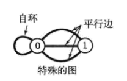

简单图：

- 没有自环和平行边就是简单图

多重图：

- 含有平行边的特殊图

顶点的度数：

- 相邻边的总数

路径：

- 由边顺序连接的一系列顶点

相关定义：

- 简单路径：无重复顶点
- 环：边数>=1，起点=终点，的路径
- 简单环：起点=终点，无重复顶点和边的环
- 长度：=边数
- 顶点连通：两个顶点间存在路径，则两顶点连通
- 连通图：任意顶点到任意顶点都存在路径，则是连通图
- 极大连通子图：若干连通子图组成了一个图，子图就是~
- 连通分量：子图
- 无环图：不含环的图
- 树：无环连通图
- 森林：若干树
- 连通图的生成树：含有所有顶点的一棵树
- 图的生成树森林：它的所有连通子图的生成树的集合
- 二分图：将所有节点分成两部分的图。图的每条边所连接的两个顶点都分别属于不同的部分

无向图的表示：

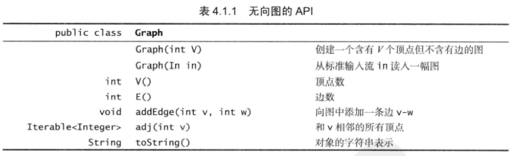

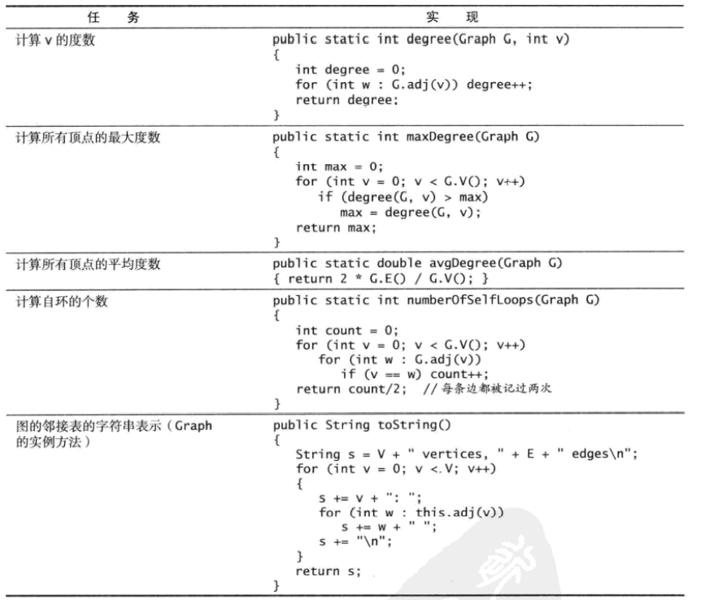

图的三种表示方法：

- 邻接矩阵：V×V的布尔矩阵等
- 边的数组：Edge类
- **邻接表数组**：以顶点为索引的列表数组

图的实现：

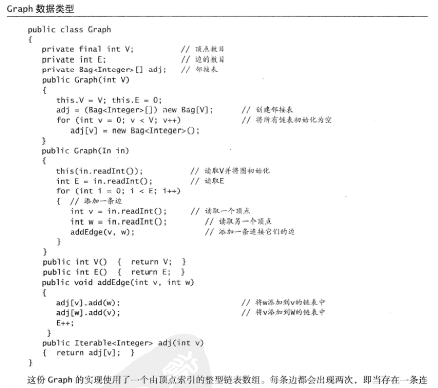

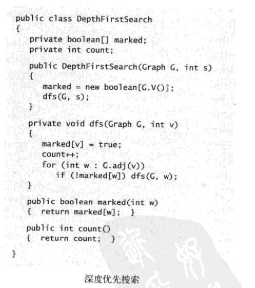

深度优先搜索常见问题：

- 从一个点到一个点是否存在路径
- 从一个点是否能走到一个点。。。。
- 找出一幅图的所有连通分量（找到所有不连通的子图的顶点和边等）
- 给定的图是无环图吗
- 是2分图吗（双色问题）
- 顶点可达性

最短路径算法：

- 


### 1.2 有向图

类似无向图，都常用DFS和BFS算法解决以上问题


### 1.3 最小生成树

prim算法

Kruskal算法


### 1.4 最短路径

Dijkstra算法

基于拓补排序的方法


### 1.5 自己总结

LeetCode

T133图节点的表示：

```java
class Node {
    public int val;
    public List<Node> neighbors;  // 邻居列表，邻接列表
}
```


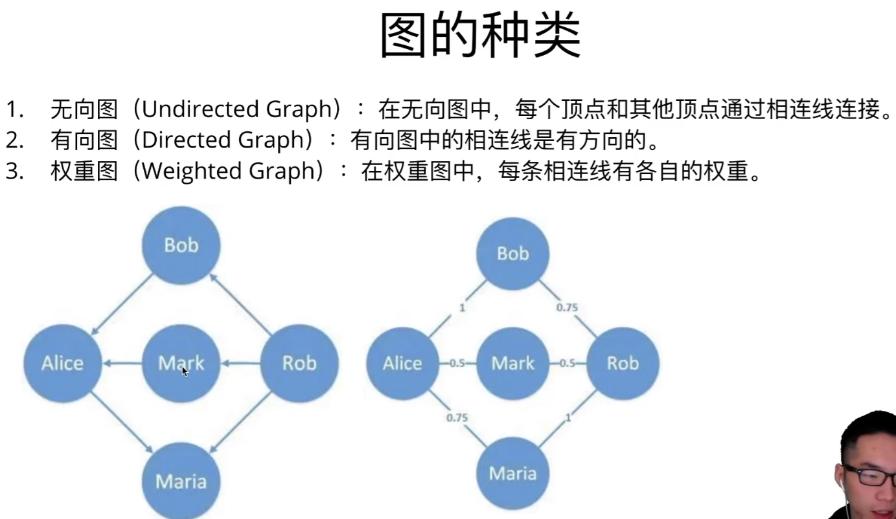

顶点：V={}

连线：E={}

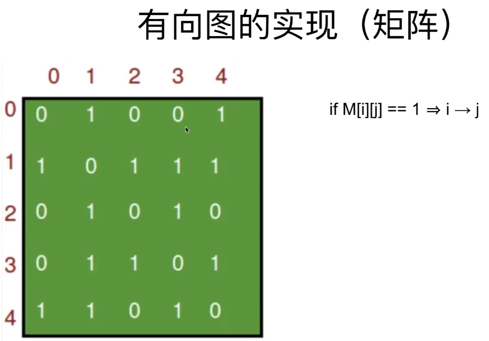

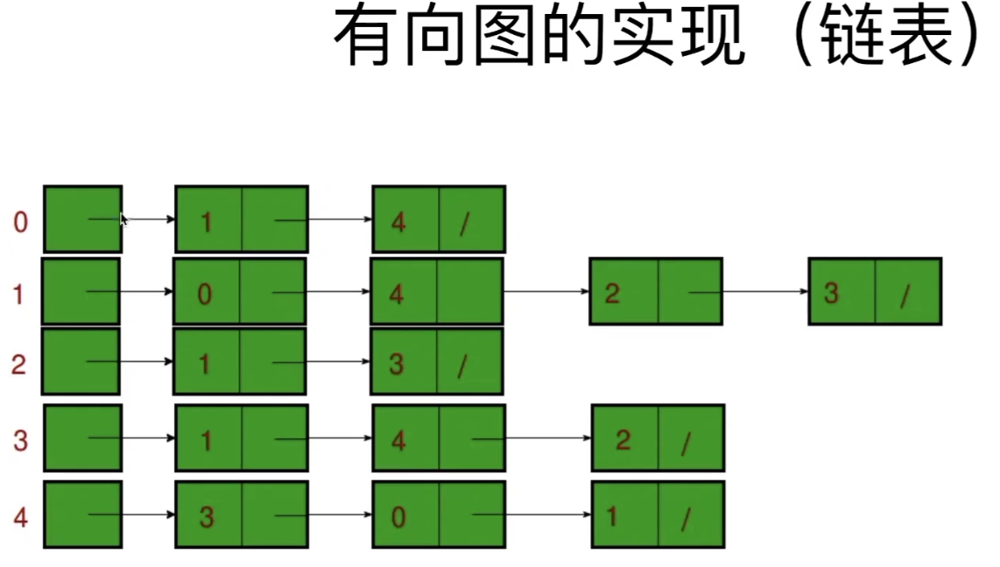

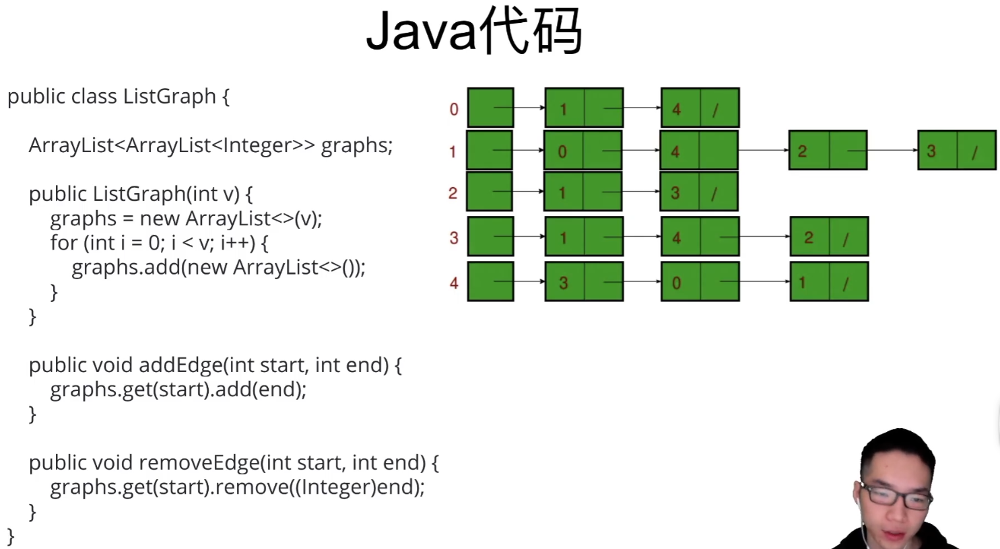

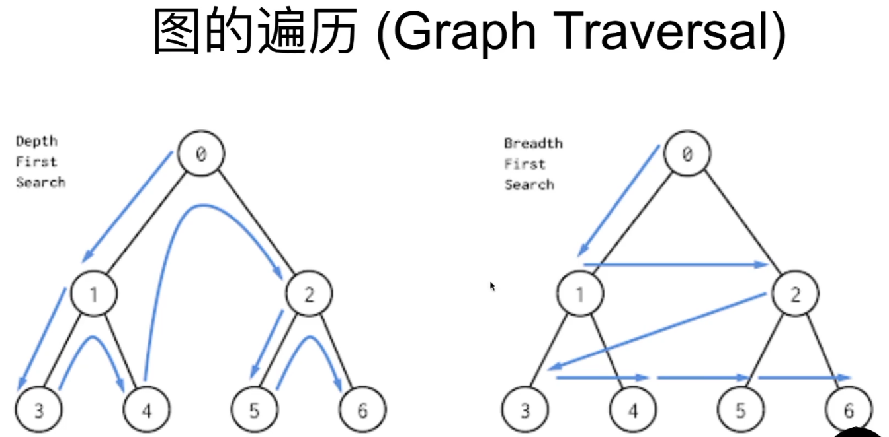

 

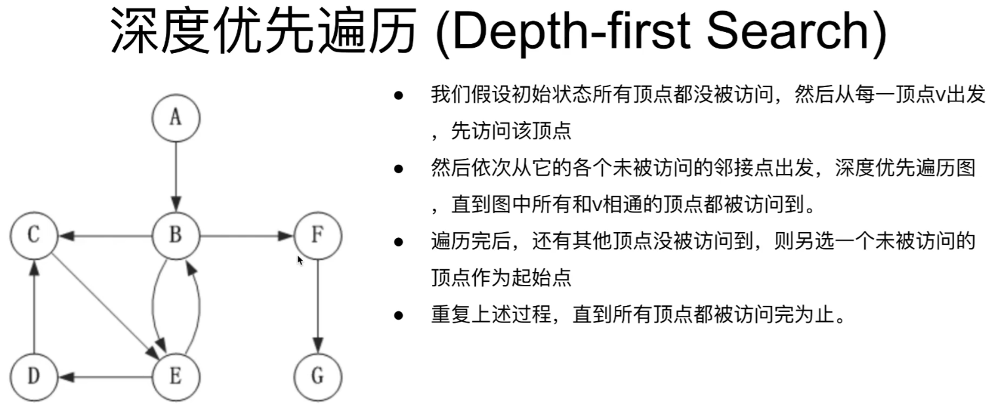

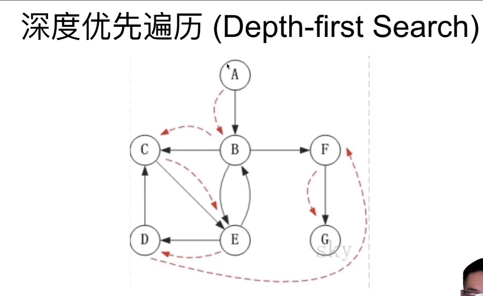


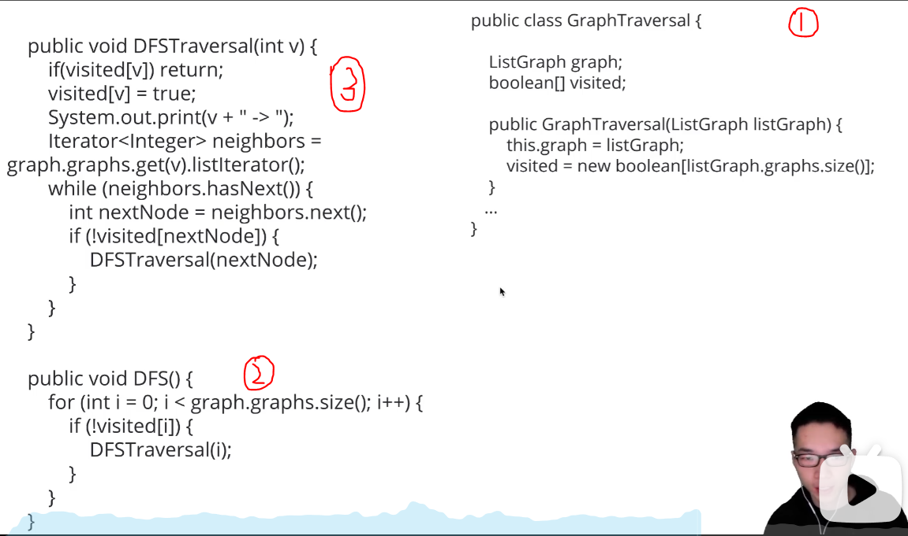

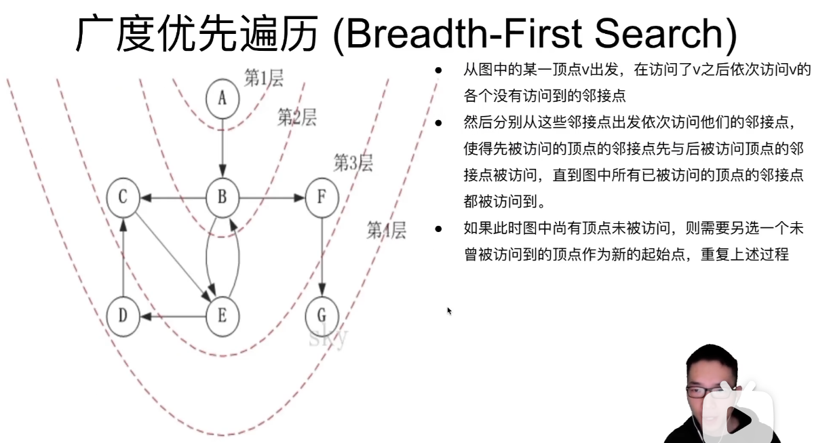


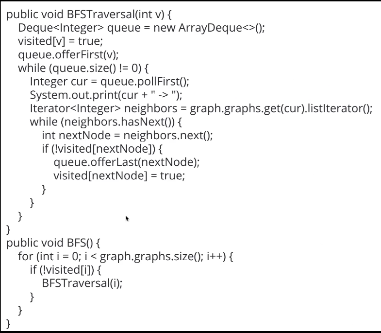

https://www.bilibili.com/video/BV1254y1976m?from=search&seid=18054589285393895691

代码实现：https://blog.csdn.net/weixin_41596800/article/details/108089752


## 2、深拷贝和浅拷贝

浅拷贝：

- 基本类型，拷贝的就是基本类型的值；
- 属性是内存地址（引用类型），拷贝的就是内存地址（改变其中一个，会对另外一个也产生影响）
- 默认拷贝构造函数只是对对象进行浅拷贝复制(逐个成员依次拷贝)，即只复制对象空间而不复制资源。
- 浅拷贝会带来数据安全方面的隐患

深拷贝：

- 基本数据类型，将属性值赋值给新的对象。其中一个对象修改该值，不会影响另外一个（和浅拷贝一样）
- 引用类型，比如数组或者类对象，深拷贝会新建对象空间，拷贝地址指向的内容。它们指向不同的内存空间。改变其中一个，不会对另外一个产生影响。

