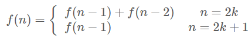
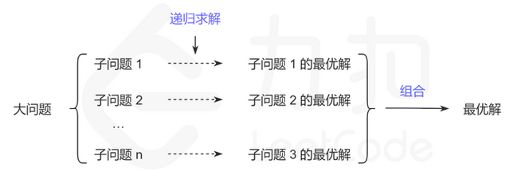

# 动态规划知识点

## 适用场景

> 有重叠子问题和最优子结构性质的问题的场景，
>
> 要解决的都是一些问题的最优解，即从很多解决问题的方案中找到最优的一个。

**举例：**斐波那契问题的状态转移方程 f(n)=f(n−1)+f(n−2)。在求 f(5)时，需要先求子问题 f(4)和 f(3)，得到结果后再组合成原问题 f(5)的解。递归地求 f(4)时，又要先求子问题 f(3)和 f(2)，这里的 f(3)与求 f(5)时的子问题重复了。

**如例子中，有重复时使用动态规划比较好；但是如果递归求解子问题时，没有出现重复子问题，则没有必要用动态规划，直接普通的递归就可以了。**

## 基本思想：大问题->子问题，记忆化存储子问题的解

> ​		大致上，若要解一个给定问题，我们需要解其不同部分（即子问题），再根据子问题的解以得出原问题的解。动态规划往往用于优化递归问题，例如斐波那契数列，如果运用递归的方式来求解会重复计算很多相同的子问题，利用动态规划的思想可以减少计算量。
>
> ​		动态规划法试图仅仅解决每个子问题一次，具有天然剪枝的功能，从而减少计算量：一旦某个给定**子问题的解已经算出，则将其记忆化存储，以便下次需要同一个子问题解之时直接查表**。这种做法在重复子问题的数目关于输入的规模呈指数增长时特别有用。

求一个问题的最优解：将问题分解成多个子问题 ---> 递归找每个子问题的最优解 ---> 通过数学方法对子问题的最优解进行组合 ---> 得到最终结果

## 关键

将子问题的解进行组合可以得到原问题的解是动态规划可行性的关键。在解题中一般用状态转移方程描述这种组合。例如原问题的解为 f(n)f(n)f(n)，其中 f(n)f(n)f(n) 也叫状态。状态转移方程 f(n)=f(n−1)+f(n−2)f(n) = f(n - 1) + f(n - 2)f(n)=f(n−1)+f(n−2) 描述了一种原问题与子问题的组合关系 。在原问题上有一些选择，不同选择可能对应不同的子问题或者不同的组合方式。例如：

找到了最优子结构，也就能推导出一个状态转移方程 f(n)f(n)f(n)，通过这个状态转移方程，我们能很快的写出问题的递归实现方法。

## 重复子问题

> **举例：**斐波那契问题的状态转移方程 f(n)=f(n−1)+f(n−2)。在求 f(5)时，需要先求子问题 f(4)和 f(3)，得到结果后再组合成原问题 f(5)的解。递归地求 f(4)时，又要先求子问题 f(3)和 f(2)，这里的 f(3)与求 f(5)时的子问题重复了。
>
> **如例子中，有重复时使用动态规划比较好；但是如果递归求解子问题时，没有出现重复子问题，则没有必要用动态规划，直接普通的递归就可以了。**

重复子问题规定的是子问题与子问题的关系。

## 将大问题 分解成 子问题

将问题规模减小的方式有很多种，一些典型的减小方式是动态规划分类的依据，例如线性，区间，树形等。这里考虑数组上常用的两种思路：