# 动态规划视频

## 来源

https://www.bilibili.com/medialist/play/ml120997143/BV1nt4y1Y7n7

## 题目特点、题型分类

> 

## 典型动态规划题型分类

## 解题步骤

我感觉，一般是从最后一步向前分析，遍历的时候从最前面依次向最后遍历，即：

**从最后面分析，从最前面计算**

## 最值型 -- 动态规划

### **组成一**

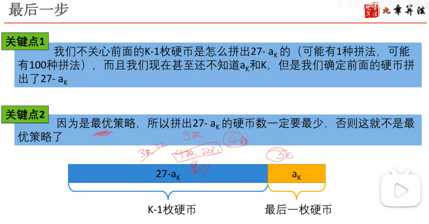

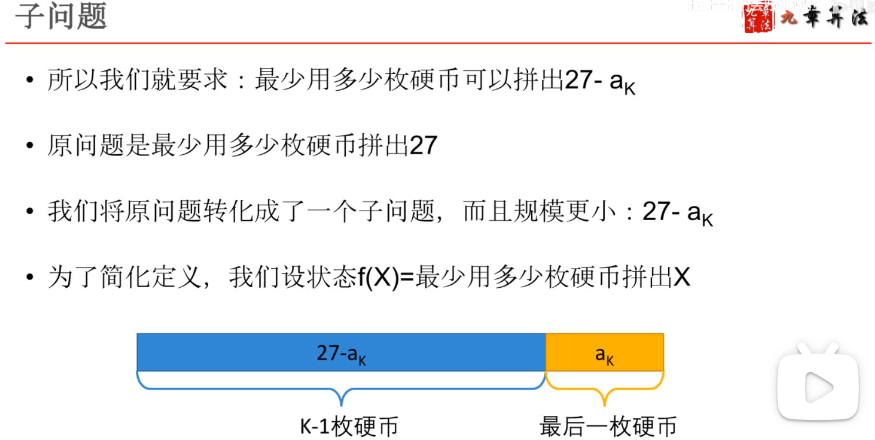

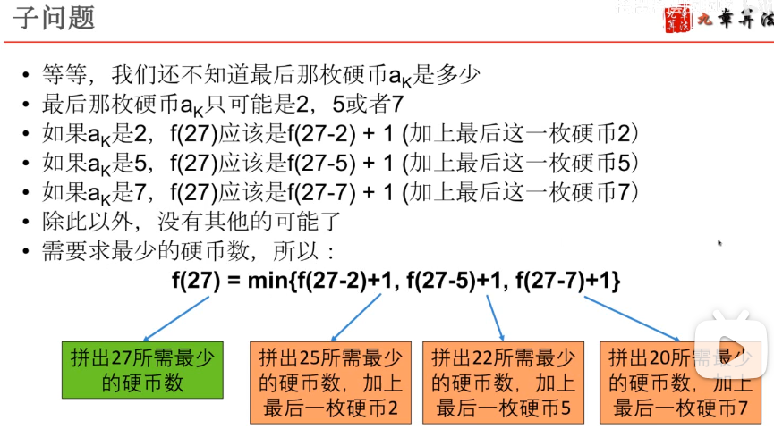

### **组成二**

### **组成三**

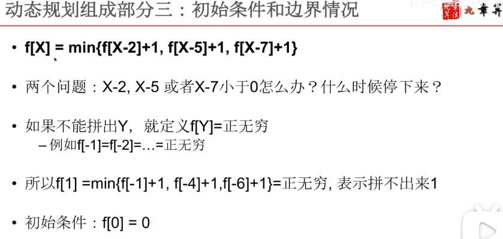

### **组成四**

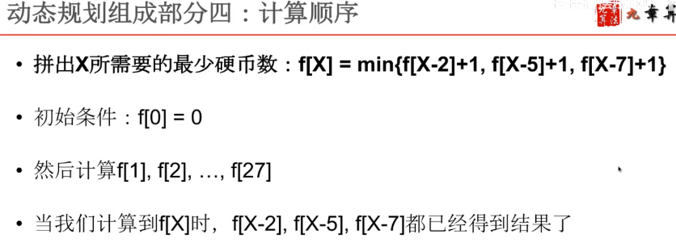

 

### **总结**

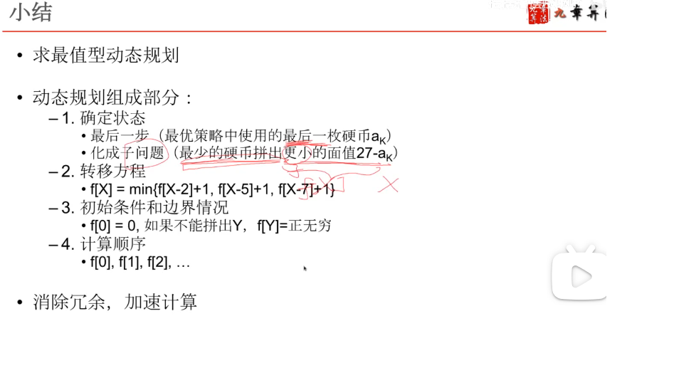

### **程序**

### **其他例题（各有特点）**

#### 1、二维棋盘路径和： 有两种子问题解的情况

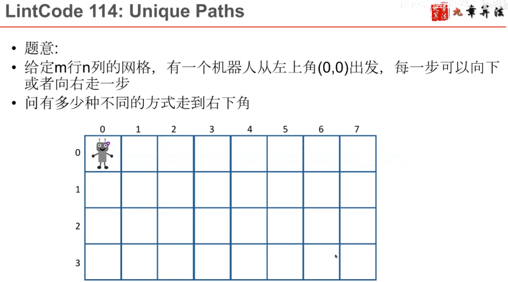

这里横着计算是因为：下一步要计算的结果 所需要的子问题结果可以直接得到。

## 存在型 -- 动态规划

### 例题

#### 1 、青蛙跳石头过河

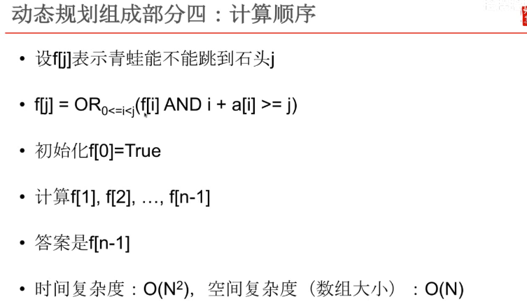

### **总结**

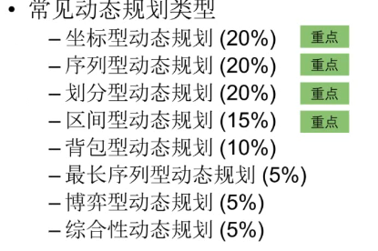

## 坐标型 -- 动态规划

### 例题引入

### **总结题型**

### **总结特点**

### **更多例题**

#### a. 最长连续单调子序列

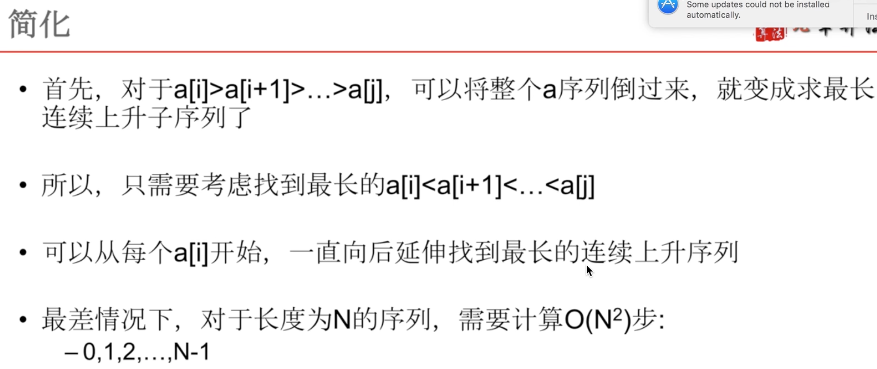

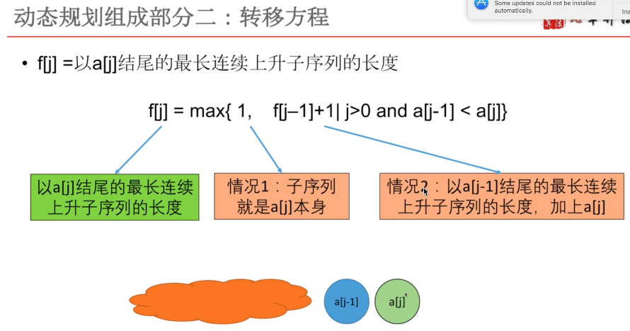

max中第二个式子中的 “|” 表示需要满足后面的条件。

#### b. 最小路径和

#### c. 炸弹网络

向上炸死敌人的数量：从第一行向最后一行计算

向下炸死敌人的数量：从最后一行向第一行计算

向左炸死敌人的数量：从最右边一列向最左边一列计算

向右炸死敌人的数量：从最左边一列向最右边一列计算

## 序列型 -- 动态规划

### 例题引入 -- 房子颜色

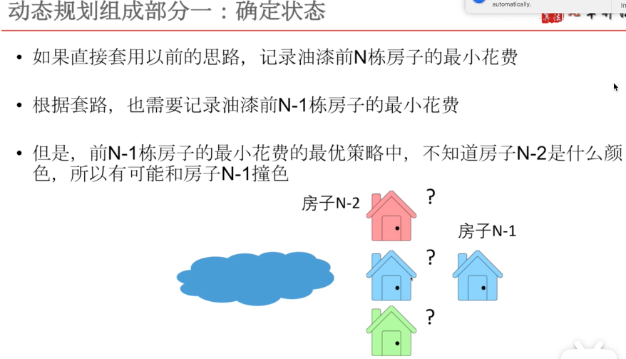

### **总结题型**

### **更多例题**

#### **a. 房子染色 ②**

 

#### b. **房子金币**

 

其中 f[i-1]表示不偷 i-1 时的最大金币，  f[2-1] + A[i-1] 表示偷 i-1 时的金币；

所以这里的定义更准确的描述是：f[i] 表示在前 i 栋房子最多偷的金币，其中第 i 栋的金币没有偷，不包括在内。

#### **c. 房子金币进阶版**

没有偷房子0时，直接忽略房子0，那么就不是圈儿了，问题转换成了上一题

如果没偷房子N-1，那么忽略 N-1， 也不是圈儿了，问题也变成了上一题

#### **d. 买卖股票**

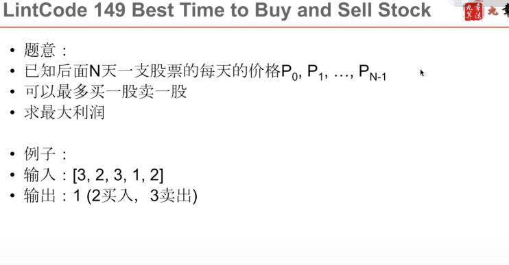

### **Type1 序列+位操作型DP**

#### **位操作**

#### **例题**

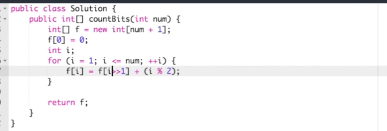

若求100到200 之间每个数转换成二进制后有多少个1，可以先算100有多少1，并算100 内数的子问题有多少个1，此时101-200中 模2的值可以直接使用100计算中的结果。

#### **总结**

1. 和位操作相关的动态规划一般用值作状态

### **Type2 序列+状态型DP**

### **Type3 最长序列型DP**

#### 方法总结

#### 例题1

#### 例题2 套信封

类似于俄罗斯套娃

## 划分型 -- 动态规划

### **例题**

#### 例题1 

这里的100是假设最后一个是2--B时有100种解密方式，50是假设最后一步12-L时有50种解密方式，所以最后一步一共假设有100中解密方式。

#### 例题2

时间复杂度： i：1~n， j：1~n½  ； 所以复杂度是n的 二分之三次方。

在上面的程序中，第二个for中，f[i - j * j] 就是 i 中除了 j * j 以外，别的加数的最少平方数。

（i - j * j ） +   （j * j）  = i

#### 例题3

#### 例题4

#### 例题5

#### 例题6

### ** 总结**