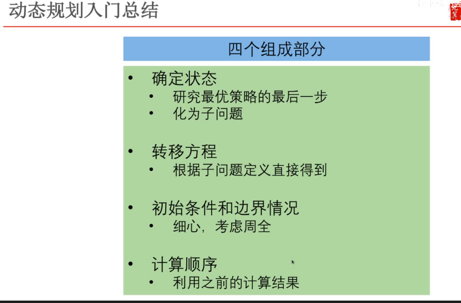
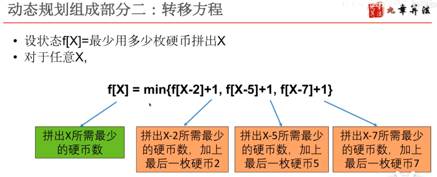
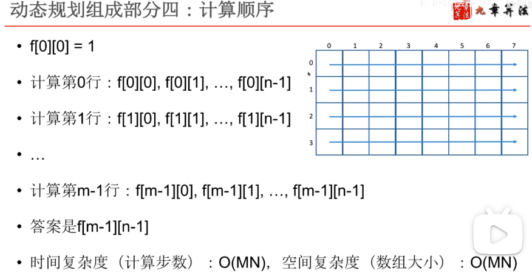
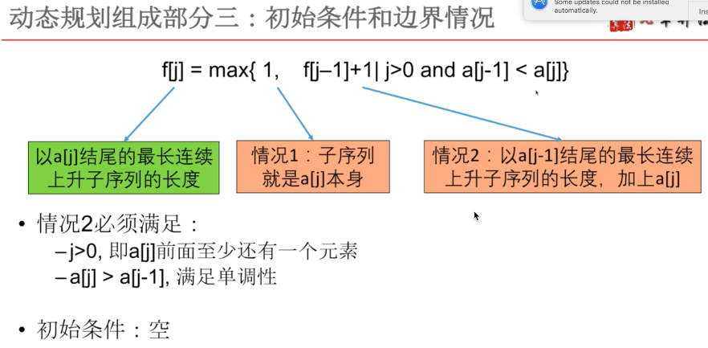
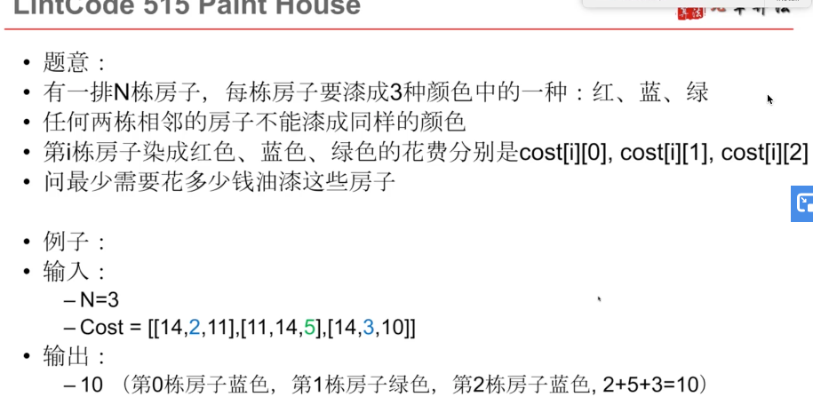

# 动态规划视频

## 来源

https://www.bilibili.com/medialist/play/ml120997143/BV1nt4y1Y7n7

## 题目特点、题型分类

> 

## 典型动态规划题型分类

## 解题步骤

## 最值型 -- 动态规划

### **组成一**

### **组成二**

### **组成三**

### **组成四**

 

### **总结**

### **程序**

### **其他例题（各有特点）**

#### 1、二维棋盘路径和： 有两种子问题解的情况

这里横着计算是因为：下一步要计算的结果 所需要的子问题结果可以直接得到。

## 存在型 -- 动态规划

### 例题

#### 1 、青蛙跳石头过河

### **总结**

## 坐标型 -- 动态规划

### 例题引入

### 总结题型

### **更多例题**

#### a. 最长连续单调子序列

max中第二个式子中的 “|” 表示需要满足后面的条件。

#### b. 最小路径和

#### c. 炸弹网络

## 序列型 -- 动态规划

### 例题

 

 

### **总结**

## 划分型 -- 动态规划

### **例题**

这里的100是假设最后一个是2--B时有100种解密方式，50是假设最后一步12-L时有50种解密方式，所以最后一步一共假设有100中解密方式。

